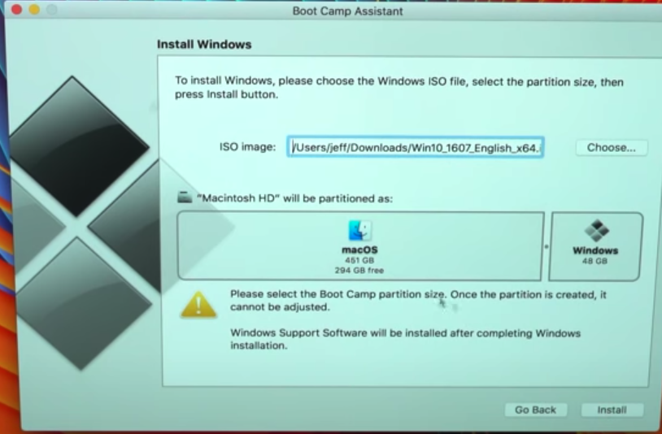
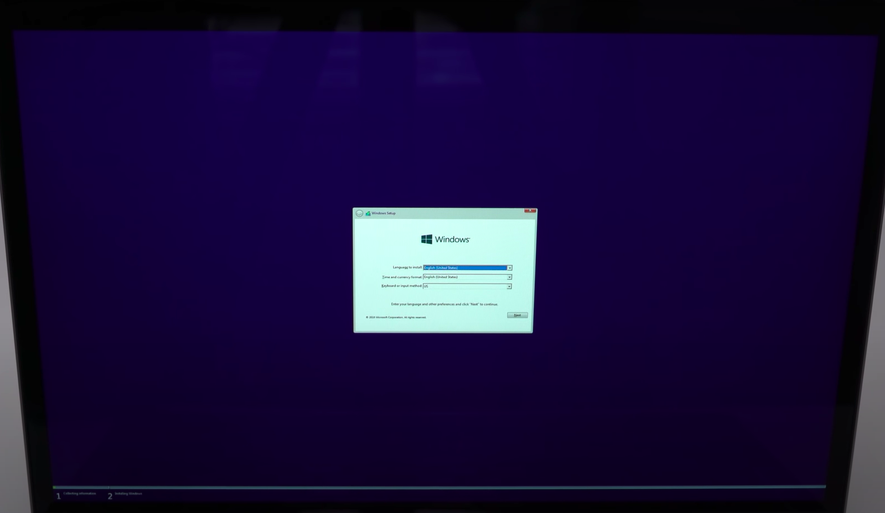

# How to partition your Mac
You ever get so frustrated that some software just do not support Mac OS and you find it difficult to navigate through the app market to find the equvilent service. Well now with **Boot Camp Assistant** you don't have to ditch your beautiful Macbook and submit to Bill Gates' Microsoft Kingdom. 
# First Step
Go to https://www.microsoft.com/en-us/software-download/windows10 and retrieve the desired windows operation system. I just chose Windows 10 English 64 bit download.
# Second Step
Press **Command + Space** and type in **Boot Camp Assistant**. After you click continue and you should be able to see the following if you have the correct windows operating system file downloaded.

# Third Step
After selecting the downloaded windows OS file, you need to drag the partition bar and create reseaonable space for your windows system. Keep in mind you still wanna leave enough space for your Mac system. For me, I made 65GB out of 500GB for my Windows system. 
  
# Installing Windows 
After setting the partition, you just need to click through the boot camp assistant and let itself configure. This might take some time. However after all that is done, the computer will restart and the window system installation page will show up. 

Then you will do the same thing as you did for boot camp assistant: clicking through the installation process.

# Restart & Booting Windows System
After that is all done, you now successfully have partitioned your Macbook. When you are starting your Mac, hold on to the **option** key after you heard the booting sound. Then you will be promt to select which operating system that you want to choose. 
